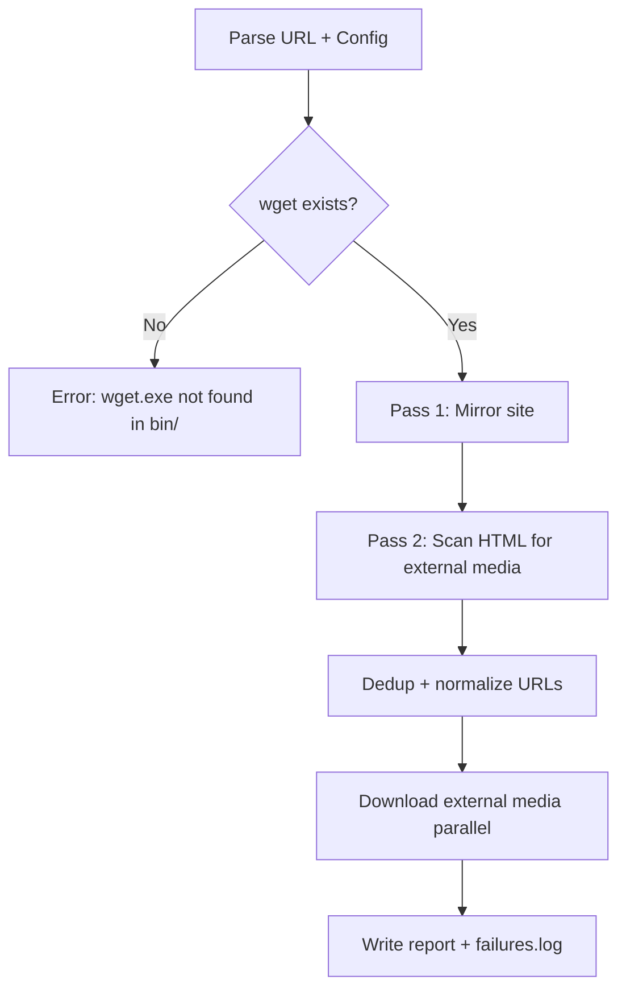

# SiteSucker -- Universal Wiki/Site Downloader

**Name**: `SiteSucker` -- works for wikis and general sites.

---

## 1. Log Issues to Fix (from pd2 run)

| Issue | Fix |
|---|---|
| Analytics pixels downloaded (matomo.php) | Add `--reject-regex` for analytics/tracking domains |
| Duplicate images with `?timestamp` querystrings | Normalize URLs: strip query strings for dedup |
| Discord CDN 404s crash silently | Log failed URLs to `failures.log`, show summary at end |
| No progress stats | Print summary: total files, total MB, failed count, duration |
| External media downloaded sequentially | Add configurable parallelism (jobs/runspaces) for pass 2 |
| No `.gitignore` for output dirs | Create proper `.gitignore` |

---

## 2. Project Structure

```
site_sucker/
  bin/
    wget.exe            (+ DLLs moved here)
  src/
    SiteSucker.psm1       # Root module: public API, orchestrator
    Invoke-SiteMirror.ps1 # Main pipeline: pass 1 + pass 2
    Get-ExternalMedia.ps1 # Pass 2: HTML parsing, external media collection
    Get-WgetPath.ps1      # Resolve wget binary from bin/
    New-WgetArgs.ps1      # Build wget argument arrays from config
    Write-SiteReport.ps1  # Final stats/summary printer
  settings.json           # Default config (user can override per-run)
  site_sucker.ps1         # Entry point (thin wrapper)
  .gitignore
  README.md
```

### Module Responsibilities

- **SiteSucker.psm1** -- dot-sources all `src/*.ps1`, exports `Invoke-SiteSucker`
- **site_sucker.ps1** -- parses CLI params, handles interactive prompts if missing, calls `Invoke-SiteSucker`
- **Invoke-SiteMirror.ps1** -- orchestrates pass 1 (mirror) and pass 2 (external media)
- **Get-ExternalMedia.ps1** -- scans downloaded HTML for external media URLs with dedup
- **Get-WgetPath.ps1** -- resolves `bin/wget.exe`, validates it exists
- **New-WgetArgs.ps1** -- converts settings.json + CLI overrides into wget arg array
- **Write-SiteReport.ps1** -- outputs download stats in a nice table

---

## 3. File Move Plan

Move from project root to `bin/`:
- `wget.exe` -> `bin/wget.exe`
- `wget.exe.debug` -> `bin/wget.exe.debug`
- `libeay32.dll` -> `bin/libeay32.dll`
- `libiconv2.dll` -> `bin/libiconv2.dll`
- `libintl3.dll` -> `bin/libintl3.dll`
- `libssl32.dll` -> `bin/libssl32.dll`

---

## 4. Settings (settings.json)

```json
{
  "UserAgent": "Mozilla/5.0 (Windows NT 10.0; Win64; x64) AppleWebKit/537.36",
  "Timeout": 15,
  "Retries": 3,
  "MaxDepth": 0,
  "OutputRoot": "./downloads",
  "WaitBetweenRequests": 0,
  "ParallelDownloads": 4,
  "RejectPatterns": [
    "action=", "oldid=", "diff=", "printable=",
    "returnto=", "redirect=", "Special:", "Talk:",
    "User:", "User_talk:", "Category_talk:",
    "load.php", "api.php"
  ],
  "RejectDomains": [
    "analytics.wikitide.net",
    "matomo."
  ],
  "MediaExtensions": [
    ".png", ".jpg", ".jpeg", ".gif", ".webp",
    ".mp4", ".webm", ".avi", ".mkv", ".mov",
    ".svg", ".ico", ".bmp", ".css", ".js", ".woff2"
  ]
}
```

User can also pass `-SettingsPath ./my-custom.json` to override.

---

## 5. Interactive Mode Flow

When `site_sucker.ps1` is run with no params:

```
SiteSucker - Universal Site Downloader
=======================================
Site URL to mirror: [user types URL]
  -> Auto-parses domain, sets output folder to ./downloads/<domain>

Output folder [./downloads/wiki.projectdiablo2.com]: [Enter to accept, or type custom]
Max depth (0=unlimited) [0]: [Enter to accept]
Number of parallel downloads [4]: [Enter to accept]

Starting download...
```

All prompts have sensible defaults derived from URL. CLI params (`-Url`, `-OutputDir`, `-Depth`, `-Parallel`) skip prompts.

---

## 6. Download Pipeline



**Pass 1**: `wget --mirror --no-parent --convert-links --page-requisites --adjust-extension` with reject-regex from config.
**Pass 2**: Parse all downloaded HTML, find external media URLs (not same domain), deduplicate (strip query strings), download with configurable parallelism.

---

## 7. Git Repo Setup

1. `git init`
2. Create `.gitignore` (exclude `downloads/`, `*.log`, `bin/wget.exe.debug`)
3. Initial commit with project structure
4. Commit after each module is created

---

## 8. Implementation Order

1. Init git repo + `.gitignore` + move bins to `bin/`
2. Create `settings.json` with defaults
3. Create `src/Get-WgetPath.ps1`
4. Create `src/New-WgetArgs.ps1`
5. Create `src/Get-ExternalMedia.ps1`
6. Create `src/Write-SiteReport.ps1`
7. Create `src/Invoke-SiteMirror.ps1`
8. Create `src/SiteSucker.psm1`
9. Create `site_sucker.ps1` entry point with interactive prompts
10. Test with a small wiki page
11. Final commit
