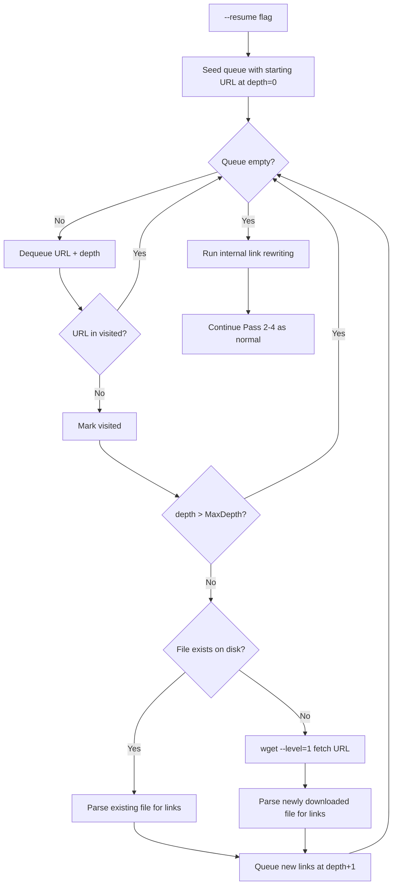

## Resume Support — Final Spec

Addresses all 4 original flaws AND all 3 review traps. Wget is demoted to a single-file downloader. Python manages the entire BFS crawl.

### Trap fixes incorporated

**Trap 1 (Frontier Problem):** Added a `visited` set to prevent infinite loops. Existing files are **still parsed for links** — they are not skipped. Only the download step is skipped.

**Trap 2 (Content-Type naming):** `url_to_filepath()` returns a base path. A separate `file_exists_on_disk()` checks both the exact path AND the `.html`-appended variant (what wget does when the server returns `Content-Type: text/html` for extensionless URLs).

**Trap 3 (No reverse map):** Removed `build_local_url_map()` entirely. `repair_internal_links()` works purely forward: read `href="https://..."` from HTML, pass it through `url_to_filepath()`, get the local path, rewrite the `href` to a relative path. No reverse-engineering needed.

### Corrected flowchart



### New module: `src/site_sucker/resume.py`

```python
url_to_filepath(url: str, output_dir: Path) -> Path
    # Forward-only: URL → expected local file path
    # Replicates wget's --restrict-file-names=windows naming:
    #   ? → @, # → @, strip fragment, keep query params
    # Does NOT append .html (that's handled by file_exists_on_disk)

file_exists_on_disk(expected_path: Path) -> bool
    # Check exact path first
    # Then check expected_path + ".html" (wget's adjust-extension behavior)
    # Returns True if either exists

resolve_local_file(expected_path: Path) -> Path | None
    # Like file_exists_on_disk but returns the actual Path that exists
    # (with or without .html suffix). None if not found.

discover_links(html_file: Path, target_domain: str, reject_patterns: list[str], reject_domains: list[str]) -> set[str]
    # BeautifulSoup: extract all <a href="https://target_domain/...">
    # Apply reject pattern filtering (same logic as wget args)
    # Skip anchors, mailto, javascript: etc.
    # Return absolute URLs

crawl_loop(url: str, output_dir: Path, target_domain: str, settings: dict) -> None
    # BFS crawl with:
    #   - visited: set[str] — prevents infinite loops (Trap 1)
    #   - queue: deque of (url, depth) tuples
    #   - MaxDepth enforcement per URL
    #   - WaitBetweenRequests sleep between wget downloads
    #   - RejectPatterns + RejectDomains filtering
    # On each iteration:
    #   1. Dequeue (url, depth)
    #   2. Skip if visited or depth exceeded
    #   3. Check file_exists_on_disk(url_to_filepath(url))
    #   4. If missing: wget --level=1 --no-directories fetch
    #   5. Parse the file (existing or newly downloaded)
    #   6. Enqueue discovered links at depth+1
```

### Modified: `src/site_sucker/repair_links.py`

Add new function `repair_internal_links(output_dir, target_domain)`:
- Scans all `.html` files in output_dir
- For each `<a href="https://target_domain/...">`:
  - Pass the exact href through `url_to_filepath(href, output_dir)`
  - Get actual path via `resolve_local_file()`
  - If file exists: rewrite href to relative path (using depth calculation already in `_repair_html_links`)
  - If file doesn't exist: leave href unchanged (broken link, not our problem)
- No reverse map needed (Trap 3 fix)

### Modified: `src/site_sucker/mirror.py`

Add resume parameter to `invoke_site_mirror()`:
```python
def invoke_site_mirror(url, output_dir, target_domain, settings, resume=False):
    if resume:
        # Skip Pass 1 wget mirror
        resume.crawl_loop(url, output_dir, target_domain, settings)
        repair_links.repair_internal_links(output_dir, target_domain)
    else:
        # Existing Pass 1 logic unchanged
        ...
    # Passes 2-4 run as normal regardless
```

### Modified: `src/site_sucker/__main__.py`

Add `--resume` CLI flag:
```
--resume    Resume an interrupted download from existing output directory
```
When used with `--output-dir`, skips Pass 1 and runs resume crawl loop.

### Key behaviors preserved
- **RejectPatterns + RejectDomains** applied in Python during `discover_links()`
- **WaitBetweenRequests** respected between wget downloads (time.sleep)
- **ParallelDownloads** can be used later (single-threaded for v1 simplicity)
- **No `--convert-links`** in resume wget calls — Python handles all rewriting
- **No `--adjust-extension`** in resume wget calls — `file_exists_on_disk()` handles the dual-check

### Files to create/modify
- **Create**: `src/site_sucker/resume.py` (~180 lines)
- **Modify**: `src/site_sucker/repair_links.py` (add `repair_internal_links`, ~60 lines)
- **Modify**: `src/site_sucker/mirror.py` (add resume branch, ~15 lines)
- **Modify**: `src/site_sucker/__main__.py` (add `--resume` flag, ~10 lines)
- **Create**: `tests/test_resume.py` (unit tests for url_to_filepath, file_exists_on_disk, discover_links)
