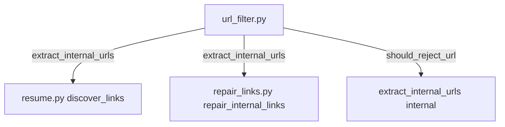

## Refactoring Plan: Shared URL Extraction for resume + repair (#5)

### Problem Analysis

`resume.py::discover_links()` and `repair_links.py::repair_internal_links()` share nearly identical URL validation logic:

1. **Parse HTML** with BeautifulSoup, iterate tags, extract URL attributes
2. **Resolve relative URLs** via `urljoin(base_url, url)`
3. **Filter by domain** (`parsed.hostname != target_domain`)
4. **Reject patterns/domains** filtering
5. **Skip non-HTTP** schemes, anchors, javascript:, mailto:

But they differ in **what they do with valid URLs**:
- `discover_links()` → returns a `set[str]` of absolute URLs (for BFS queue)
- `repair_internal_links()` → rewrites tag attributes to local relative file paths

### Approach: Extract `extract_internal_urls()` into `url_filter.py`

Create a shared `extract_internal_urls(soup, base_url, target_domain, reject_patterns, reject_domains) -> set[str]` function that handles the **discovery** part. Both modules call it instead of reimplementing.

### Changes

#### 1. `url_filter.py` — Add `extract_internal_urls()`

```python
# Tags and attributes to scan for navigation links
_NAV_TAGS = [("a", ["href"])]

# Tags and attributes to scan for embedded resources
_RESOURCE_TAGS = [
    ("img", ["src", "data-src"]),
    ("script", ["src"]),
    ("link", ["href"]),
    ("video", ["src"]),
    ("audio", ["src"]),
    ("source", ["src", "data-src"]),
]

def extract_internal_urls(
    soup: BeautifulSoup,
    base_url: str,
    target_domain: str,
    reject_patterns: list[str] | None = None,
    reject_domains: list[str] | None = None,
) -> set[str]:
    """Extract all internal URLs from a parsed HTML document."""
```

Walks all `_NAV_TAGS + _RESOURCE_TAGS`, resolves via `urljoin`, filters via `should_reject_url()`, strips fragments, returns `set[str]`.

#### 2. `resume.py::discover_links()` — Simplify to use shared function

Replace the 20-line tag iteration + `_add_url()` closure with a single call:

```python
def discover_links(html_file, base_url, target_domain, reject_patterns=None, reject_domains=None):
    # read file → soup
    soup = BeautifulSoup(content, "lxml")
    return extract_internal_urls(soup, base_url, target_domain, reject_patterns, reject_domains)
```

#### 3. `repair_links.py::repair_internal_links()` — Reuse for `<a>` loop

Replace the inline `<a>` tag loop (15 lines of URL resolution + domain filtering + reject checking) with:

```python
# Get all internal navigation URLs (already filtered)
nav_urls = extract_internal_urls(soup, base_url, target_domain)

# Rewrite only <a> tags whose href matches a discovered URL
for tag in soup.find_all("a", href=True):
    href = tag["href"]
    if href.startswith(("#", "javascript:", "mailto:")):
        continue
    absolute_url = urljoin(base_url, href)
    if absolute_url.split("#")[0] not in nav_urls:
        continue
    # ... existing file resolution + relpath logic
```

This removes the duplicated `urlparse` / domain check / reject logic from the `<a>` loop.

#### 4. `_rewrite_tag_urls()` stays as-is

The resource tag rewriting (`_rewrite_tag_urls`) already exists as a helper and does **localization** (URL → file path), not just extraction. It's a separate concern and doesn't overlap with `discover_links`.

#### 5. Tests

- Add `test_url_filter.py` with tests for `extract_internal_urls()` covering: basic links, relative resolution, reject patterns/domains, fragment stripping, data URLs, resource tags (img/script/link/video/audio/source).
- Existing `test_resume.py::test_discover_links_*` tests remain and validate the integration.
- Existing `test_repair_links.py` tests remain unchanged.

### Diagram



### Files Modified
- `src/site_sucker/url_filter.py` — add `extract_internal_urls()` + tag/attr constants
- `src/site_sucker/resume.py` — simplify `discover_links()` to delegate to shared function
- `src/site_sucker/repair_links.py` — simplify `<a>` loop in `repair_internal_links()` to use shared function

### Files Created
- `tests/test_url_filter.py` — tests for `extract_internal_urls()`

### Risk
Low — `discover_links()` is only used by the resume crawler's `process_discovered_links()`. `repair_internal_links()` is a standalone pass. The shared function is a pure extraction with no I/O side effects.
